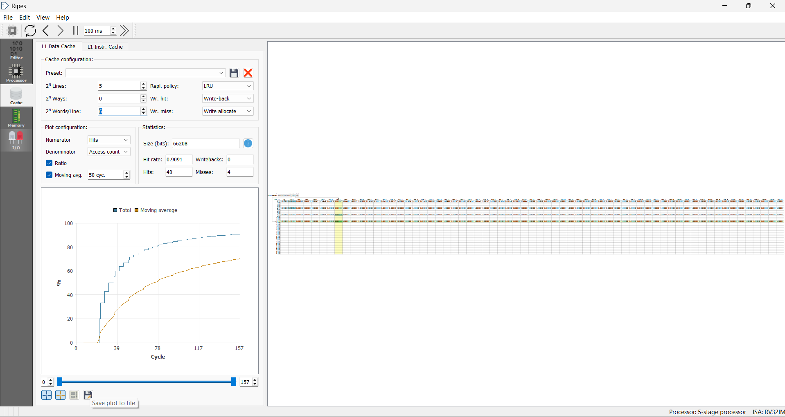
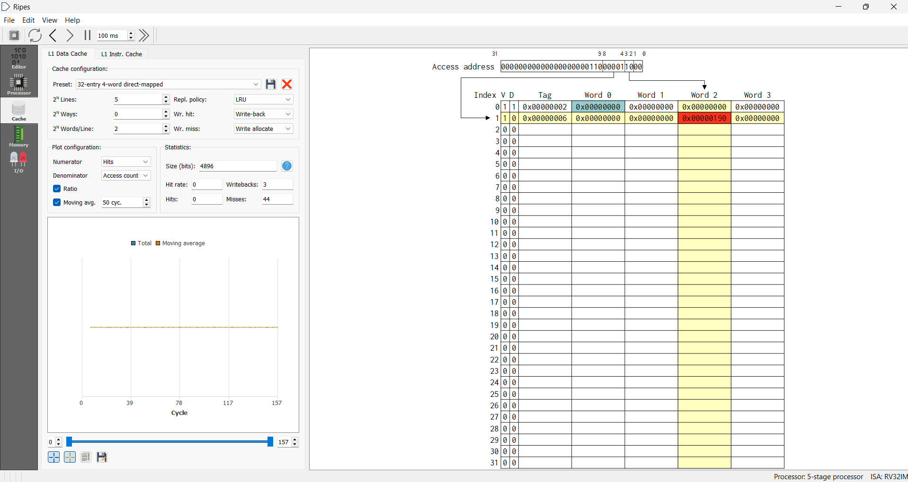
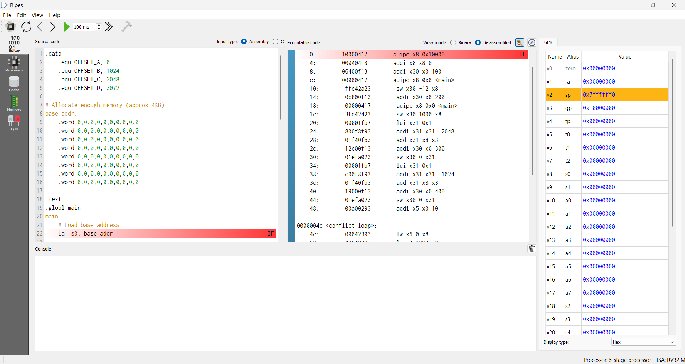

# Cache Conflict Analysis and Optimization using RISC-V Assembly

## Project Overview

This project demonstrates cache conflict analysis using RISC-V Assembly language in the Ripes simulator. The objective was to study cache behavior, generate conflict misses, and analyze how cache configuration affects system performance.

## Objectives

- Understand cache memory organization
- Study conflict misses in a direct-mapped cache
- Implement memory access patterns using RISC-V Assembly
- Analyze cache hit and miss rates
- Optimize cache performance through configuration changes

## Tools Used

- RISC-V Assembly Language
- Ripes Simulator
- Cache Memory Simulator

## Project Implementation

The program:

1. Allocates memory locations with specific offsets.
2. Stores data at selected addresses.
3. Accesses memory repeatedly to generate cache conflicts.
4. Measures cache performance using Ripes cache statistics.
5. Compares performance before and after optimization.

## Cache Configuration

### Initial Configuration

- Direct-Mapped Cache
- Small cache size
- High conflict misses

### Optimized Configuration

- Increased cache capacity
- Improved memory access behavior
- Reduced cache conflicts

## Results

### Before Optimization

- Hits: 0
- Misses: 44
- Hit Rate: 0%

### After Optimization

- Hits: 40
- Misses: 4
- Hit Rate: 90.91%

## Screenshots

### Source Code

### Conflict Access Pattern

### Optimized Cache Performance

## Key Concepts Learned

- Cache Memory
- Direct-Mapped Cache
- Cache Conflicts
- Cache Hit and Miss Analysis
- RISC-V Assembly Programming
- Computer Architecture

## Future Improvements

- Compare Direct-Mapped and Set-Associative Caches
- Analyze different replacement policies
- Measure execution cycles for various cache configurations

## Author

Adwaith Suresh

B.Tech Computer Science and Engineering

KTU
